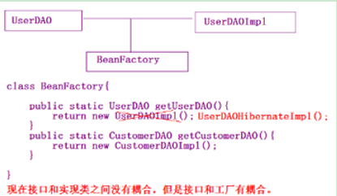

<!-- TOC -->

- [概述](#概述)
- [方式一：最原始的方式-直接new对象](#方式一最原始的方式-直接new对象)
    - [UsersDao类](#usersdao类)
    - [变更需求之后的改动](#变更需求之后的改动)
    - [dao层接口实现类](#dao层接口实现类)
    - [BeanFactory模拟spring 工厂接口](#beanfactory模拟spring-工厂接口)
    - [ClassPathXmlApplicationContext 模拟spring读取配置文件的类](#classpathxmlapplicationcontext-模拟spring读取配置文件的类)
    - [beans.xml配置文件](#beansxml配置文件)
    - [UserServiceTest 测试类](#userservicetest-测试类)
    - [输出](#输出)

<!-- /TOC -->
# 概述 #

IOC 是英文 Inversion of Control(控制反转)的缩写。

控制反转我认为可以这样理解，以前对象创建销毁的控制权是掌握在我们自己手里的，我们自己要创建对象，可以通过new的方式调用对象的构造方法去创建，而，使用了spring框架之后，这种对象控制权被反转了，对象的创建Spring框架帮我们做了。

下面我将通过几个示例，来体现控制反转的原理，以及使用控制反转的好处。
假设现在要实现一个简单的三层的调用逻辑，即controller层调用service层，service层调用dao层。

# 方式一：最原始的方式-直接new对象
service层要调用dao层的方法，最原始的方式就是直接创建一个dao层类的对象，然后，调用该对象的方法。

``` java
package com.xiewei.spring.demo1;
import org.junit.Test;
public class SpringDemo {    
    @Test
    /**
     * 传统方式的调用
     */
    public void demo1(){
        UsersDao userDAO = new UsersDao();
        userDAO.save();
    }
}
```
## UsersDao类

``` java
package com.xiewei.spring.demo1;
public class UsersDao {
    public void save() {
        System.out.println("UsersDao执行了...");
    }
}
```
输出：
UsersDao执行了...   


## 变更需求之后的改动
如果dao层修改了数据库的连接方式，如：由之前的jdbc修改为 hibernate，代码应该怎么修改？
根据设计模式的开闭原则，对新增开放，对修改关闭，在尽可能少的改动源码的要求下，最佳方案是下面这样的，dao层新增一个UsersHibernateDao类。

 ``` java
package com.xiewei.spring.demo1;
public class UsersHibernateDao {
    public void save() {
        System.out.println("UsersHibernateDao执行了...");
    }
}  ```

然后，再修改service层代码的调用方式：
 
``` java
package com.xiewei.spring.demo1;
import org.junit.Test;
public class SpringDemo {    
    @Test
    /**
     * 传统方式的调用
     */
    public void demo1(){
        UsersHibernateDao userDAO = new UsersHibernateDao ();
        userDAO.save();
    }
}
 ```

 
## 不足之处

dao层发生了变动，对service层的影响比较大，也就是耦合性高。
 在上面的示例中，dao层的变动，要修改service层代码的两处。如果，是一个非常复杂的系统，有成千上万个类的系统，那这个修改的工作量就会非常的庞大，改动越大出错的可能性就越大。
 那如何进行优化呢？可以使用面向接口编程的方式进行优化

# 方式二：通过面向接口编程解耦

**什么是面向接口编程？**
通俗的理解就是，在dao层定义接口，该层每个类都去继承相应的接口，service层要调用dao层的方法，通过new 接口的方式创建对象。也可以理解为通过多态的方式去创建对象。

## service层

``` java
package com.xiewei.spring.demo1;
import org.junit.Test;
public class SpringDemo {
    @Test
    /**
     * 面向接口编程的方式
     */
    public void demo2(){
        UserDAO userDAO = new UserDAOJDBCImpl();
        userDAO.save();
    }
}
```
## dao层定义接口
实现两个层之间的解耦
``` java
package com.xiewei.spring.demo1;
public interface UserDAO {
    public void save();
}
 ```
## dao层接口实现类

```java
 package com.xiewei.spring.demo1;
/**
 * UserDao接口，使用jdbc的方式来实现。
 * 每个方法内部，使用jdbc方法操作数据库
 @author XW
 * @create_date 2019年1月14日
 */
public class UserDAOJDBCImpl implements UserDAO {
	@Override
	public void save() {
		System.out.println("UserDAOJDBCImpl执行了...");
	}
}
 ```
输出
```
   UserDAOJDBCImpl执行了...   
```
## 变更需求

如果，这个项目的数据库连接发生变动了，由之前的jdbc变为hibernate，需要修改哪些地方。
1. 先新增一个实现了接口的类，如下。

```java
package com.xiewei.spring.demo1;
/**
 * UserDao接口，使用hibernate的方式来实现。
 * 每个方法内部，使用hibernate方法操作数据库
 * @author XW
 * @create_date 2019年1月14日
 */
public class UserDAOHibernateImpl implements UserDAO {

	@Override
	public void save() {
		System.out.println("UserDAOHibernateImpl执行了...");
	}

}
```
2. 修改service层的调用代码
```java
package com.xiewei.spring.demo1;
import org.junit.Test;
public class SpringDemo {
    @Test
    /**
     * 面向接口编程的方式
     */
    public void demo2(){
        UserDAO userDAO = new UserDAOHibernateImpl();
        userDAO.save();
    }
}
```
## 总结

通过面向接口编程方式优化了代码，service层只需要修改一个地方，很显然，使用面向接口编程的方式，降低了service层和dao层的耦合性。
上面这个例子是只有一个类的情况，如果，是一个具有成千上万个类的复杂系统，减少一半的改动，就将出错的可能性降低了一半，也可以算是很大的优化了。

## 不足之处

1. 接口和实现类之间还是有耦合关系，还是需要修改已经写好的所有service层中类的代码，修改完之后，需要重新编译和打包、部署。

2. 存在泄密风险，在实际项目中，如果，一些service层中有一些类中方法涉及到核心算法（如：搜索引擎、彩票、MD5加盐规则等），这些service层中的方法，可能并没有调用dao层中的方法，使用这种方式，还需要将这些核心方法暴露给修改者。

# 方式三：工厂模式进一步解耦

工厂模式，将所有对象的创建都集中在工厂类中，
在service层的方法中，调用工厂类的获取对象方法。

```java
public class SpringDemo {
    @Test
    /**
     * 面向接口编程的方式
     */
    public void demo2(){
        UserDAO userDAO = new BeanFactory.setUserDAO();
        userDAO.save();
    }
}
```
## 工厂类如下图


使用这种模式的好处是不再需要修改所有的service层中类的代码，而，是只需要修改一个工厂类中的代码。
熟悉工厂模式的话，很容易理解，这个例子就不展示代码了。

## 对比面向接口编程

这种方式，相对于面向接口编程的方式，service层中修改的地方，集中在工厂类中，进一步的减少了修改的代码的数量,降低了耦合性。

## 不足之处

这种方式，还是需要修改工厂类的代码，然后，重新编译打包项目。
即：dao层接口和工厂类还是有耦合关系。

# 方式四：工厂模式+反射+配置文件进一步解耦

这种方式就是spring的ioc的方式，就是ioc的底层实现原理，在此我们模拟一下 。
## UserDAO接口

```java
package com.xiewei.dao;
import com.xiewei.model.User;
public interface UserDAO {
	public void save(User user);
}
```
## UserDAOImpl dao层接口实现类

```java
package com.xiewei.dao.impl;
import com.xiewei.dao.UserDAO;
import com.xiewei.model.User;
public class UserDAOImpl implements UserDAO {
	public void save(User user) {		
		System.out.println("执行UserDAO中的保存方法！ user saved!");
	}
}
```
 ## UserService类

```java
package com.xiewei.service;
import com.xiewei.dao.UserDAO;
import com.xiewei.model.User;
public class UserService {
	private UserDAO userDAO;  
	public void add(User user) {
		userDAO.save(user);
	}
	public UserDAO getUserDAO() {
		return userDAO;
	}
	public void setUserDAO(UserDAO userDAO) {
		this.userDAO = userDAO;
	}
}
```
 ## User 实体类

```java
   package com.xiewei.model;

public class User {
	private String username;
	private String password;
	public String getUsername() {
		return username;
	}
	public void setUsername(String username) {
		this.username = username;
	}
	public String getPassword() {
		return password;
	}
	public void setPassword(String password) {
		this.password = password;
	}
}
 ```

## BeanFactory模拟spring 工厂接口

```java
package com.xiewei.spring;

public interface BeanFactory {
	public Object getBean(String id);
}
```

## ClassPathXmlApplicationContext 模拟spring读取配置文件的类

**spring****源代码中也有一个类叫****ClassPathXmlApplicationContext**，其内部实现原理就是下面这样的。

```java
  package com.xiewei.spring;
import java.lang.reflect.Method;
import java.util.HashMap;
import java.util.List;
import java.util.Map;
import org.jdom.Document;
import org.jdom.Element;
import org.jdom.input.SAXBuilder;
public class ClassPathXmlApplicationContext implements BeanFactory {
	private Map<String , Object> beans = new HashMap<String, Object>();
	@SuppressWarnings("unchecked")
    public ClassPathXmlApplicationContext() throws Exception {
		SAXBuilder sb=new SAXBuilder();
	    Document doc=sb.build(this.getClass().getClassLoader().getResourceAsStream("beans.xml")); //构造文档对象
	    Element root=doc.getRootElement(); //获取根元素HD
	    List list=root.getChildren("bean");//取名字为disk的所有元素
	    for(int i=0;i<list.size();i++){
	       Element element=(Element)list.get(i);
	       String id=element.getAttributeValue("id");
	       String clazz=element.getAttributeValue("class");
	       Object o = Class.forName(clazz).newInstance();
	       System.out.println("程序运行，读取配置文件,获取到，第"+i+"个bean标签中id="+id);
	       System.out.println("程序运行，读取配置文件,获取到，第"+i+"个bean标签中class="+clazz);
	       beans.put(id, o);
	       System.out.println("程序运行，通过反射的方式创建类"+clazz+"的对象，将对象保存在一个Map集合中，集合中的key="+id);
	       for(Element propertyElement : (List<Element>)element.getChildren("property")) {
	    	   String name = propertyElement.getAttributeValue("name"); //userDAO
	    	   String bean = propertyElement.getAttributeValue("bean"); //u
	           System.out.println("第"+i+"个<bean>标签下有<property>标签，就表示要为bean标签中"+clazz+"类中的对象中的"+name+"属性赋初始值");
	    	   Object beanObject = beans.get(bean);//UserDAOImpl instance
	    	   String methodName = "set" + name.substring(0, 1).toUpperCase() + name.substring(1);
	    	   Method m = o.getClass().getMethod(methodName, beanObject.getClass().getInterfaces()[0]);
	    	   m.invoke(o, beanObject);
	           System.out.println("程序运行，通过反射的方式执行方法： " + methodName+",为属性"+name+"赋值成功");
	       }
	    }  
	  }
	public Object getBean(String id) {
		return beans.get(id);
	}
}
```
 
## beans.xml配置文件

```java
<beans>
	<bean id="u" class="com.xiewei.dao.impl.UserDAOImpl" />
	<bean id="userService" class="com.xiewei.service.UserService" >
		<property name="userDAO" bean="u"/>
	</bean>	
</beans>

```
## UserServiceTest 测试类
```java
package com.xiewei.service;
import org.junit.Test;
import com.xiewei.model.User;
import com.xiewei.spring.BeanFactory;
import com.xiewei.spring.ClassPathXmlApplicationContext;
public class UserServiceTest {
	@Test
	public void testAdd() throws Exception {
		BeanFactory applicationContext = new ClassPathXmlApplicationContext();
		UserService service = (UserService)applicationContext.getBean("userService");
		User u = new User();
		u.setUsername("lisi");
		u.setPassword("123");
		service.add(u);
	}
}
```
##  输出

```
1.	程序运行，读取配置文件,获取到，第0个bean标签中id=u  
2.	程序运行，读取配置文件,获取到，第0个bean标签中class=com.xiewei.dao.impl.UserDAOImpl  
3.      程序运行，通过反射的方式创建类com.xiewei.dao.impl.UserDAOImpl的对象，将对象保存在一个Map集合中，集合中的key=u  
4.	程序运行，读取配置文件,获取到，第1个bean标签中id=userService  
5.	程序运行，读取配置文件,获取到，第1个bean标签中class=com.xiewei.service.UserService  
6.	程序运行，通过反射的方式创建类com.xiewei.service.UserService的对象，将对象保存在一个Map集合中，集合中的key=userService  
7.	第1个<bean>标签下有<property>标签，就表示要为bean标签中com.xiewei.service.UserService类中的对象中的userDAO属性赋初始值  
8.	程序运行，通过反射的方式执行方法： setUserDAO,为属性userDAO赋值成功  
9.	执行UserDAO中的保存方法！ user saved!  
```

------
